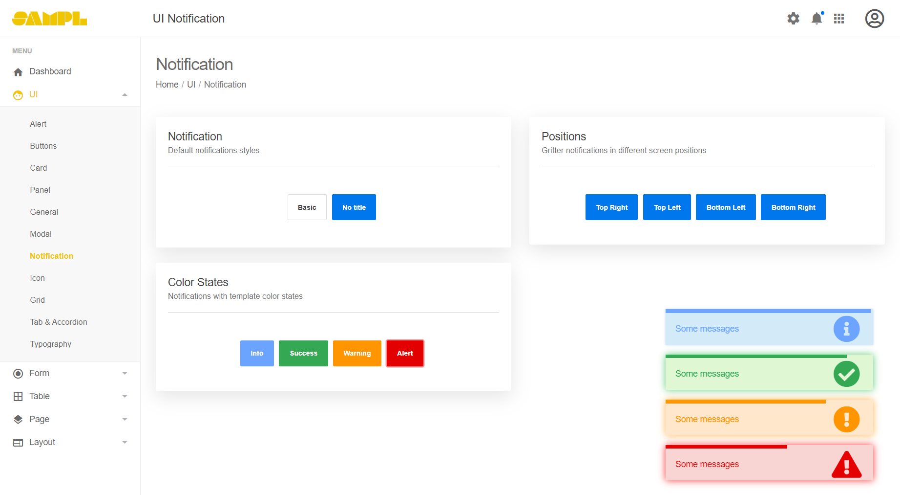
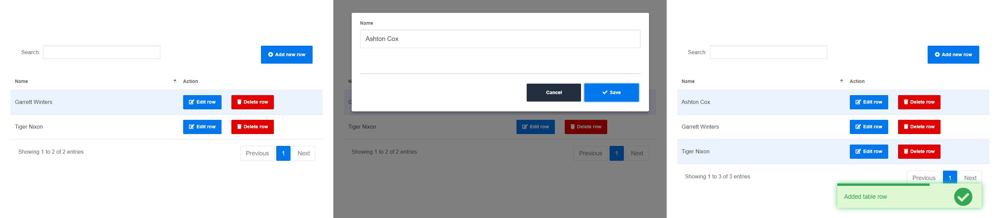
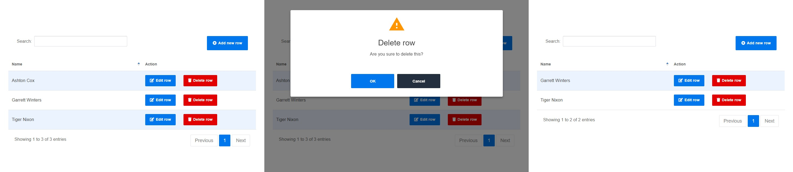

# bs-theme

This is a Bootstrap 4 theme.

This is still in development and will be published at a later date.

## Changelog

### [0.0.39] - 2020-08-13

- Changed the icon color of the icon navigation in the color header to white.

### [0.0.38] - 2020-08-13

- Optimize padding above and below cells in small tables (.table-sm).

### [0.0.37] - 2020-08-13

- Added dark background header.An example is in "./documentation/layout-dark-header.html".

    Dark Header:  

    

    Primary Header:  

    

    Success Header:  

    

    Warning Header:  

    

    Danger Header:  

    

### [0.0.36] - 2020-08-12

- Removed gray background and box shadows for boxed layouts and splash screens.

### [0.0.35] - 2020-08-11

- Optimized the icon size of the icon navigation menu (.bt-icons-nav> .nav-item) that is not a drop-down type(src/sass/includes/structure/top-header/\_icons-nav.scss).

    Desktop icon navigation:  

    

    Mobile and tablet icon navigation:  

    

### [0.0.34] - 2020-08-09

- Added validation for maximum upload file size(./src/components/Validator.js). Also add examples(./documentation/form-validation.html).

    ```js
    <form id="myForm">
      <div class="form-group row">
        <label class="col-12 col-sm-3 col-form-label text-sm-right">Upload file size</label>
        <div class="col-12 col-sm-8 col-lg-6">
          <input class="inputfile" id="file" type="file" name="file" required data-parsley-max-file-size="1">
          <label class="btn-secondary" for="file"><i class="mdi mdi-upload"></i><span>Browse file...</span></label>
        </div>
      </div>
      <div class="form-group row text-right">
        <div class="col col-sm-10 col-lg-9 offset-sm-1 offset-lg-0">
          <button class="btn btn-space btn-primary" type="submit">Submit</button>
        </div>
      </div>
    </form>

    import { Validator, $ } from 'bs-theme';

    // Form validation
    const validator = new Validator('#myForm');
    validator.on('submit', event => {
      alert('Submit');
    });
    ```

### [0.0.33] - 2020-08-09

- Added usage of data table row template to changelog.

### [0.0.32] - 2020-08-09

- Added theme color to background color of notifications.(./documentation/ui-notifications.html).

    

- Added example of adding, editing and deleting rows in data table(./documentation/table-datatables.html).

    The table row template uses Handlebars.  
    See the reference (https://handlebarsjs.com/guide/) for details.  

    Add row:  
    

    Delete row:  
    

    Sample code:  

    ```js
    <table class="table table-striped table-hover table-fw-widget" id="myTable">
      <thead><tr><th>Name</th><th>Action</th></tr></thead>
      <tbody>
        <script type="text/html" id="myTemplate">
          <tr data-id="{{{id}}}">
            <td>{{name}}</td>
            <td class="text-nowrap">
              <button edit class="btn btn-sm btn-primary"><i class="fas fa-edit mr-1"></i>Edit row</button>
              <button delete class="btn btn-sm btn-danger ml-4"><i class="fas fa-trash mr-1"></i>Delete row</button>
            </td>
          </tr>
        </script>
      </tbody>
    </table>

    <div class="modal-container custom-width modal-effect-9" id="myModal">
      <div class="modal-content">
        <div class="modal-body">
          <form id="myForm">
            <div class="form-group">
              <label>Name</label>
              <input name="name" type="text" class="form-control">
            </div>
          </form>
        </div>
        <div class="modal-footer">
          <button class="btn btn-dark modal-close" type="button" data-dismiss="modal">Cancel</button>
          <button class="btn btn-primary" type="submit" form="myForm"><i class="fas fa-check mr-1"></i>Save</button>
        </div>
      </div>
    </div>

    import { $, DataTable, ConfirmModal, Modal, Notifier } from 'bs-theme';

    // Add, delete, edit table rows
    const dt = new DataTable('#myTable', {
      template: '#myTemplate',
      columnDefs: [
        { targets: 0, name: 'name' },
        { targets: 1, name: 'action', orderable: false, searchable: false }
      ],
      buttons: [{
        text: '<i class="fas fa-plus-circle mr-1"></i>Add new row',
        className: 'btn-primary',
        action: async () => {
          const res = await myModal.open();
          if (!res) return;
          dt.addRow(res);
          Notifier.success('Added table row');
        }
      }]
    });

    // Add and edit modal
    const myModal = new (class extends Modal {
      constructor() {
        super('#myModal');
        this.form = this.modal.find('form:first');
        this.modal.on('submit', 'form', event => {
          event.preventDefault();

          // Convert input data to object
          const data = {};
          new FormData(this.form.get(0)).forEach((value, key) => data[key] = value);

          // Returns input data to the caller
          this.resolve(data);
        });
      }
      async open(set = undefined) {
        const promise = super.open();
        if (set !== undefined) {
          // Display data of selected table row in form when editing
          this.form.find('[name="name"]:first').val(set.name);
        }
        return promise;
      }
      beforeOpen() {
        super.beforeOpen();
        this.form.get(0).reset();
      }
    });

    // Draw rows
    const rows = [
      { id: 1, name: 'Tiger Nixon' },
      { id: 2, name: 'Garrett Winters' }
    ];
    for (let row of rows) dt.addRow(row);

    // Edit and delete actions
    const confirmModal = new ConfirmModal();
    dt.table
      .on('click', '[delete]', async event => {
        if (!(await confirmModal.open('Delete row', 'Are you sure to delete this?'))) return;
        const row = $(event.currentTarget).closest('tr');
        await dt.deleteRow(row);
      })
      .on('click', '[edit]', async event => {
        const row = $(event.currentTarget).closest('tr');
        const res = await myModal.open({ name: dt.getRowData(row, 0) });
        if (!res) return;
        dt.updateRow(row, res);
        Notifier.success('Changed table row');
      });
    ```

### [0.0.31] - 2020-08-09

- Fix the bug that validator locale doesn't work when bundled(./src/components/Validator.js).

### [0.0.30] - 2020-08-08

- Added locale to validation component(./src/components/Validator.js). An example is in ./documentation/form-validation.html.

    ```js
    <form id="form">
      <div class="form-group">
        <label>Email</label>
        <input class="form-control" type="email" required parsley-type="email">
      </div>
      <div class="form-group">
        <label>Password</label>
        <input class="form-control" type="password" required>
      </div>
      <button class="btn btn-primary" type="submit">Submit</button>
    </form>

    import { Validator } from 'bs-theme';

    // Initialize form validation.
    // The first parameter is the form to validate (form ID or HTMLFormElement, or jqElement of the form).
    // The second parameter is the locale. The default is "en".
    // Available locales are al, ar, bg, ca, cs, da, de, el, en, es, et, eu, fa, fi, fr, he, hr, hu, id, it, ja, ko, lt, lv, ms, nl, no, pl, pt_br, pt_pt, ro, ru, sk, sl, sq, sr, sv, th, tk, tr, ua, uk, ur, zh_cn, zh_tw.
    // See "https://parsleyjs.org/doc/" for details on HTML validation attributes.
    const validator = new Validator('#form', 'ja');
    //const validator = new Validator(document.querySelector('#form'), 'en');
    //const validator = new Validator($('#form'), 'en');

    // If all errors are resolved, the submit event will be called.
    validator.on('submit', event => {
      // When there are no errors
      alert('Submit');
    });
    ```

### [0.0.29] - 2020-08-03

- Added sign-in page example(./documentation/page-login.html, ./documentation/page-login2.html).
- Added sign-up page example(./documentation/page-sign-up.html).
- Added forgot password page example(./documentation/page-forgot-password.html).

### [0.0.28] - 2020-08-03

- Fixed example link(./documentation/\*.html).

### [0.0.27] - 2020-08-03

- Added layout example(./documentation/layout-\*.html).
- Added general table example(./documentation/table-general.html).
- Added theme color header SCSS(./src/sass/includes/structure/\_top-header.scss).
- Fixed the bug that the layout of the table column dropdown is broken(./src/sass/includes/bootstrap/\_tables.scss).
- Fixed SCSS of off canvas menu(./src/sass/includes/structure/\_top-header.scss).

### [0.0.26] - 2020-08-02

- Added Introduction(./getting-started) and API Document(./documentation) to public files

### [0.0.25] - 2020-08-02

- Added alert UI example(./documentation/ui-alerts.html).
- Added card UI example(./documentation/ui-cards.html).
- Added panel UI example(./documentation/ui-panels.html).
- Added General UI example(./documentation/ui-general.html).
- Added icon UI example(./documentation/ui-icons.html).
- Added grid system example(./documentation/ui-grid.html).
- Added tab and accordion example(./documentation/ui-tabs-accordions.html).
- Added tab and accordion example(./documentation/ui-tabs-accordions.html).
- Added typography example(./documentation/ui-typography.html).

### [0.0.24] - 2020-08-01

- Added notification module(./src/components/Notifier.js) and example(./documentation/ui-notifications.html).

### [0.0.23] - 2020-07-30

- Changed to return the processing result of promise after closing it with modal base class.  
- Changed so that the caller can receive the result of OK or cancellation selected modally.
    
    To get whether the OK button or the Cancel button is selected, add the 'data-result="true"' attribute to the [OK] button.  
    Returns "true" if the OK button is selected and "false" if the cancel button or escape key is selected.  

    ```JS
    <div class="modal-container modal-effect-1" id="myModal">
      <div class="modal-content">
        <div class="modal-header">
          <button class="close" type="button" data-dismiss="modal" aria-hidden="true"><span class="mdi mdi-close"></span></button>
        </div>
        <div class="modal-body">
          <div class="text-center">
            <div class="text-success"><span class="modal-main-icon mdi mdi-check"></span></div>
            <h3>Title</h3>
            <p>Message</p>
            <div class="mt-8">
              <button class="btn btn-secondary btn-space" type="button" data-dismiss="modal">Cancel</button>
              <button class="btn btn-success btn-space" type="button" data-dismiss="modal" data-result="true">OK</button>
            </div>
          </div>
        </div>
      </div>
    </div>

    import { Modal } from 'bs-theme';

    const myModal = new Modal('#myModal');
    const result = await myModal.open();// true or false
    ```

    Also, the result can return any value.  
    For example, if you want to return the submission result of a form in a modal, do the following.  

    ```js
    <div class="modal-container colored-header colored-header-success custom-width modal-effect-9" id="myModal">
      <div class="modal-content">
        <div class="modal-header modal-header-colored">
          <h3 class="modal-title">Title</h3>
          <button class="close modal-close" type="button" data-dismiss="modal" aria-hidden="true"><span class="mdi mdi-close"></span></button>
        </div>
        <div class="modal-body">
          <form id="myForm">
            <div class="form-group">
              <label>Email</label>
              <input class="form-control" type="email" placeholder="username@example.com">
            </div>
            <div class="form-group">
              <label>Name</label>
              <input class="form-control" type="text" placeholder="John Doe">
            </div>
          </form>
        </div>
        <div class="modal-footer">
          <button class="btn btn-secondary modal-close" type="button" data-dismiss="modal">Cancel</button>
          <button class="btn btn-success modal-close" type="submit" form="myForm">OK</button>
        </div>
      </div>
    </div>

    import { Modal, $ } from 'bs-theme';

    // A modal that returns the form submission result
    class MyModal extends Modal {
      constructor() {
        super($('#myModal'));
        this.modal.on('submit', 'form', event => {
          event.preventDefault();
          this.resolve('Submit!');
        });
      }
    }
    const myModal = new MyModal();
    const result = await myModal.open();// 'Submit!' or false
    ```

### [0.0.22] - 2020-07-29

- Changelog added to ReadMe.

### [0.0.21] - 2020-07-28

- Fixed a bug that the button text option of confirmation modal was not applied(./src/components/ConfirmModal.js).

### [0.0.20] - 2020-07-28

- Added modal example(./documentation/ui-modals.html).  
- Fixed a bug that set button text failed in confirmation dialog(./src/components/ConfirmModal.js).

### [0.0.19] - 2020-07-28

- Datatable example page added (./documentation/table-datatables.html).

### [0.0.18] - 2020-07-27

- Align vertical position of horizontal form group (.form-group.row) to baseline.

### [0.0.17] - 2020-07-27

- Removed background color and box shadow of box layout (.bt-boxed-layout).

### [0.0.16] - 2020-07-25

- Optimized primary, success, warning and danger colors.  
- Optimized the validation error color, success color, and error message design.

### [0.0.15] - 2020-07-25

- Optimize the font size of form labels.

### [0.0.14] - 2020-07-25

- Optimize text field height.

### [0.0.13] - 2020-07-24

- Optimized form control and button size.

### [0.0.12] - 2020-07-24

- Change align of horizontal form control label (.col-form-label) from right to left.

### [0.0.11] - 2020-07-23

- Changed to align the label of inline form group (.form-group.row) automatically to the right according to the size of media query.

### [0.0.10] - 2020-07-23

- Removed background color and border bottom of modal header.

### [0.0.9] - 2020-07-23

- Add 1x size to round icon.

### [0.0.8] - 2020-07-23

- Added important option to the font size of round icons.

### [0.0.7] - 2020-07-23

- Add Sass such as round icon.

### [0.0.6] - 2020-07-23

- Add margin bottom to a form group inside a modal.

### [0.0.5] - 2020-07-22

- The header of the confirmation dialog is not used, so it is deleted.

### [0.0.4] - 2020-07-21

- Add dialog base class(DialogBase).

### [0.0.3] - 2020-07-20

- Add custom validation setting method (addValidator) to Validator class.

### [0.0.2] - 2020-07-20

- Change public file.

### [0.0.0] - 2020-07-20

- Trial release.
